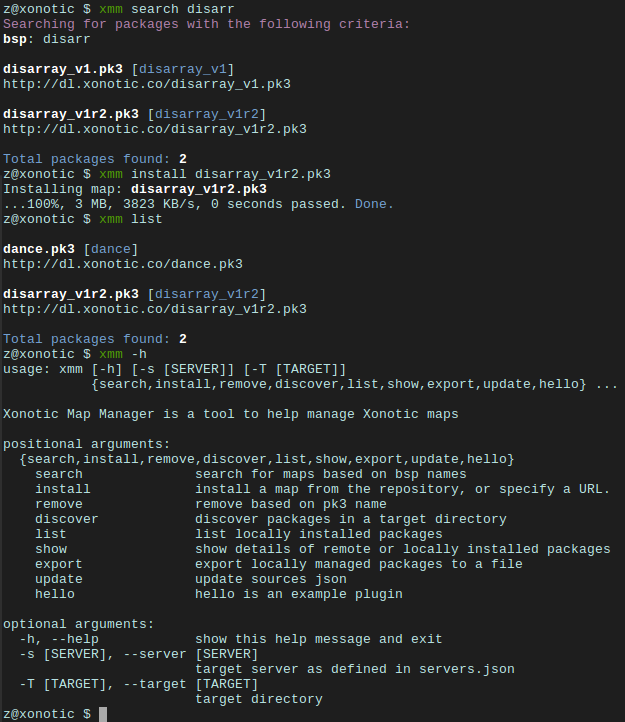

# xonotic-map-manager

## About

A command-line package manager for the [xonotic-map-repository](https://github.com/z/xonotic-map-repository) project.

Used by default with the unofficial Xonotic map repository [xonotic.co](http://xonotic.co).



The JSON provides rich metadata about map packages which makes it easier
to discern differences between them.

For information about what data is available check [JSON Structure](#JSON-structure).

## Installation

```
python3 setup.py install
```

## Configuration

The default settings are likely similar to yours, however, you may need
to edit `~/.xmm.cfg` if you aren't using `~/.xonotic/data` as a path for
map packages.

`~/.xmm.cfg`:

```
# This file is read from ~/.xmm.cfg, make sure that's where you are editing it
[default]

# Where should xmm manage maps?
map_dir = ~/.xonotic/data/

# You don't need to change these unless you're running your own repo
repo_url = http://dl.xonotic.co/
api_data = ~/.xmm/maps.json
api_data_url = http://xonotic.co/resources/data/maps.json

# This is only preference
use_curl = False

# local tracking of installed packages
package_store = ~/.xmm/packages.db

# (optional) configuration of servers to use with multiple servers
servers = ~/.xmm/servers.json
```

## Usage

```
usage: xmm [-h] [-T [T]] [-s [S]]
           {search,install,remove,discover,list,show,export,update,hello} ...

Xonotic Map Manager is a tool to help manage Xonotic maps

positional arguments:
  {search,install,remove,update,list,show,export,hello}
    search              search for maps based on bsp names
    install             install a map from the repository, or specify a URL.
    remove              remove based on pk3 name
    discover            discover packages in a target directory    
    list                list locally installed packages
    show                show details of locally installed package
    export              export locally managed packages to a file
    update              update sources json    
    hello               hello is an example plugin

optional arguments:
  -h, --help            show this help message and exit
  -T [T]                target directory
  -s [S]                target server as defined in servers.json
```

### Searching

```
xmm search snowdance
Searching for: snowdance
snowdance2
http://dl.xonotic.co/snowdance2.pk3
snowdance2
http://dl.xonotic.co/snowdance_xon.pk3
```

```
xmm search -p bloodrage_v2.pk3 --long  
Searching for packages with the following criteria:
pk3: bloodrage_v2.pk3

         pk3: bloodrage_v2.pk3
         bsp: bloodrage_v2
       title: Bloodrage
 description: Small, brutal and violent 1on1 map
      author: Cortez and FruitieX
      shasum: 488b05976e73456bf6f9833e353f72d3a8d0cbce
        date: 2009-10-17
        size: 1MB
          dl: http://dl.xonotic.co/bloodrage_v2.pk3

Total packages found: 1
```

Inline help is available on all sub-commands:

```
xmm search -h                
usage: xmm search [-h] [--gametype [GAMETYPE]] [--pk3 [PK3]] [--title [TITLE]]
                  [--author [AUTHOR]] [--shasum [SHASUM]] [--long] [--short]
                  [--highlight]
                  [string]

positional arguments:
  string                bsp name found in a package, works on packages with
                        many bsps

optional arguments:
  -h, --help            show this help message and exit
  --gametype [GAMETYPE], -g [GAMETYPE]
                        filter by gametype
  --pk3 [PK3], -p [PK3]
                        filter by pk3 name
  --title [TITLE], -t [TITLE]
                        filter by title
  --author [AUTHOR], -a [AUTHOR]
                        filter by author
  --shasum [SHASUM]     filter by shasum
  --long, -l            show long format
  --short, -s           show short format
  --highlight, -H       highlight search term in results

```

### Installing from the repository

```
xmm install snowdance_xon.pk3
Installing map from repository: snowdance_xon.pk3
...100%, 5 MB, 2438 KB/s, 2 seconds passed. Done.
```

```
xmm install snowdance_xon.pk3 
Installing map from repository: snowdance_xon.pk3
package already exists, please remove first.
```

```
xmm install fake.pk3   
Installing map from repository: fake.pk3
package does not exist in the repository.
```

Example below is also showing the use of curl instead of python's urllib:

```
xmm install http://somerepo.org/snowdance2.pk3
Adding map: http://somerepo.org/snowdance2.pk3
  % Total    % Received % Xferd  Average Speed   Time    Time     Time  Current
                                 Dload  Upload   Total   Spent    Left  Speed
100 5530k  100 5530k    0     0   205k      0  0:00:26  0:00:26 --:--:--  179k
Done.
```

```
xmm install http://somerepo.org/snowdance2.pk3
Adding map: http://somerepo.org/snowdance2.pk3
map already exists, please remove first.
```

### Removing

```
xmm remove snowdance2.pk3
Removing map: snowdance2.pk3
Done.
```

```
xmm remove snowdance2.pk3
Removing map: snowdance2.pk3
map does not exist.
```


### Discover

A summary of discovered packages:

```
xmm -s myserver1 discover

map-ctf-moonstone_nex_r3.pk3 [moonstone_nex_r3]
http://dl.xonotic.co/map-ctf-moonstone_nex_r3.pk3

map-ctf-mIKEctf1_nex_r1.pk3 package was not found in repository

dance.pk3 [dance]
http://dl.xonotic.co/dance.pk3


snowdance_xon.pk3 [snowdance2]
http://dl.xonotic.co/snowdance_xon.pk3


dance-fixed.pk3 [dance-fixed]
http://dl.xonotic.co/dance-fixed.pk3


got_wood-on-xctf3.pk3 [got_wood]
http://dl.xonotic.co/got_wood-on-xctf3.pk3


map-ctf-mikectf3_nex_r3_fix.pk3 [mIKEctf3_nex_r3]
http://dl.xonotic.co/map-ctf-mikectf3_nex_r3_fix.pk3

map-vapor_alpha_2.pk3 hash different from repositories

```

Add discovered maps:

```
xmm -s myserver1 discover --add
```

### List

```
xmm list

gasoline_02.pk3 [gasoline_02, gasoline_3teams_02, gasoline_4teams_02, gasoline_noteams_02]
http://dl.xonotic.co/gasoline_02.pk3

dance.pk3 [dance]
http://dl.xonotic.co/dance.pk3

Total packages found: 2

```

```
xmm list -l

         pk3: gasoline_02.pk3
         bsp: gasoline_02
       title:  Gasoline Powered
 description:  Retextured and glowy
      author:  FruitieX, Kid, Mario
         bsp: gasoline_3teams_02
       title:  Gasoline Powered
 description:  Retextured and glowy with 3 teams
      author:  FruitieX, Kid, Mario, Freddy
         bsp: gasoline_4teams_02
       title:  Gasoline Powered
 description:  Retextured and glowy with 4 teams
      author:  FruitieX, Kid, Mario
         bsp: gasoline_noteams_02
       title:  Gasoline Powered - Teamless
 description:  Retextured and glowy
      author:  FruitieX, Kid, Mario
      shasum: 099b0cc16fe998e5e29893dbecd5673683a5b69d
        date: 2015-10-17
        size: 14MB
          dl: http://dl.xonotic.co/gasoline_02.pk3

         pk3: dance.pk3
         bsp: dance
       title:  <TITLE>
 description:  <DESCRIPTION>
      author:  <AUTHOR>
      shasum: ef00d43838430b2d1673f03bbe1440eef100ece6
        date: 2008-03-16
        size: 7MB
          dl: http://dl.xonotic.co/dance.pk3


Total packages found: 3
```

### Show

```
xmm show dance.pk3

dance.pk3
dance
http://dl.xonotic.co/dance.pk3
```

```
xmm show dance.pk3 -l

         pk3: dance.pk3
         bsp: dance
       title: <TITLE>
 description: <DESCRIPTION>
      author: <AUTHOR>
      shasum: ef00d43838430b2d1673f03bbe1440eef100ece6
        date: 2008-03-16
        size: 7MB
          dl: http://dl.xonotic.co/dance.pk3
```

### Export

```
% xmm export test.json
% cat test.json
[{"mapinfo": ["maps/dance.mapinfo"], "date": 1205715512, "title": "<TITLE>", "radar": [], "waypoints": [], "gametypes": ["ctf", "dm", "lms", "arena"], "mapshot": ["maps/dance.jpg"], "description": "<DESCRIPTION>", "shasum": "ef00d43838430b2d1673f03bbe1440eef100ece6", "filesize": 7468410, "pk3": "dance.pk3", "map": ["maps/dance.map"], "author": "<AUTHOR>", "license": false, "bsp": {"dance": {"entities": {"item_cells": 14, "item_bullets": 14, "info_player_team1": 10, "item_rockets": 16, "info_player_team2": 11, "item_invincible": 1, "weapon_hagar": 2, "item_flag_team1": 1, "weapon_electro": 2, "item_health_medium": 14, "item_health_small": 20, "weapon_machinegun": 2, "item_strength": 1, "weapon_vortex": 3, "item_armor_small": 19, "weapon_devastator": 2, "item_flag_team2": 1, "weapon_grenadelauncher": 2}}}}]% 
```

### Update

```
xmm update
Updating sources json.
...100%, 7 MB, 2559 KB/s, 3 seconds passed. Done.
```

## Advanced Usage

### Multi-server support

xmm can facilitate the management of multiple servers with a `~/.xmm/~servers.json` file to configure their settings, example below:

```
{
  "myserver1": {
    "target_dir": "~/.xonotic/data/myserver1/",
    "package_db": "~/.xmm/packages-myserver1.db"
  },
  "myserver2": {
    "target_dir": "~/.xonotic/data/myserver2/",
    "package_db": "~/.xmm/packages-myserver2.db"
  }
}
```

An example is available in `./config/example.servers.json`

To use these servers, use the `-s` flag to target the server.

```
xmm -s myserver1 install dance.pk3
xmm -s myserver1 list
xmm -s myserver1 remove dance.pk3
```

## Developers

### Plugin System

Checkout the examples in the `./xmmc/plugins` directory.

```python
from plugins import pluginbase
from xmmc import util

bcolors = util.bcolors
config = pluginbase.get_config()


def get_args():
    command='hello'
    command_help={'help': 'hello is an example plugin'}
    args=['-f', '--foo']
    kwargs={'type': int, 'nargs': '?', 'help': 'this is a help line'}
    return command, command_help, args, kwargs


def run():
    print("Hello from a plugin!")
    print("Look, I have access to the config: " + config['api_data'])
    print(bcolors.BOLD + "and also utils" + bcolors.ENDC)
```

### JSON structure

Same structure used by [xonotic-map-repository](https://github.com/z/xonotic-map-repository):

```json
{
  "data": [
    {
      "date": 1453749340,
      "filesize": 7856907,
      "bsp": {
        "vapor_alpha_2": {
          "radar": "gfx/vapor_alpha_2_mini.tga",
          "waypoints": "",
          "title": "Vapor",
          "description": "Such CTF. Many Vehicles. Wow.",
          "map": "maps/vapor_alpha_2.map",
          "entities": {
            "info_player_deathmatch": 4,
            "info_player_team1": 11,
            "info_player_team2": 11,
            "item_armor_big": 10,
            "item_armor_large": 4,
            "item_armor_medium": 16,
            "item_armor_small": 124,
            "item_bullets": 10,
            "item_cells": 14,
            "item_flag_team1": 1,
            "item_flag_team2": 1,
            "item_health_large": 6,
            "item_health_medium": 30,
            "item_health_mega": 2,
            "item_health_small": 100,
            "item_invincible": 1,
            "item_rockets": 20,
            "item_strength": 1,
            "weapon_crylink": 4,
            "weapon_devastator": 6,
            "weapon_electro": 2,
            "weapon_grenadelauncher": 6,
            "weapon_hagar": 4,
            "weapon_machinegun": 6,
            "weapon_vortex": 4
          },
          "mapinfo": "maps/vapor_alpha_2.mapinfo",
          "author": "-z-",
          "gametypes": [
            "ctf",
            "DM"
          ],
          "license": true,
          "mapshot": "maps/vapor_alpha_2.jpg"
        }
      },
      "shasum": "3df0143516f72269f465070373f165c8787964d5",
      "pk3": "map-vapor_alpha_2.pk3"
    }
  ]
}
```